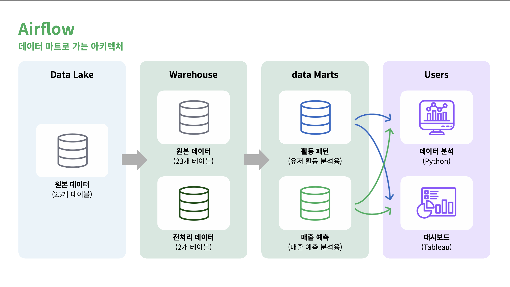
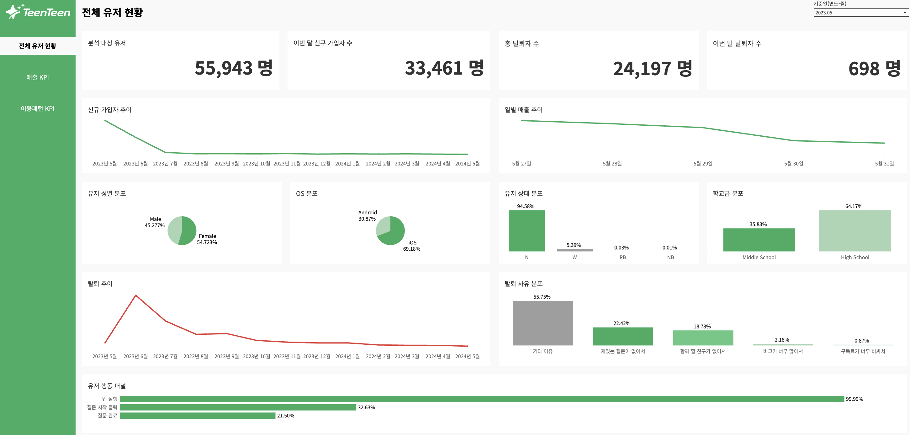
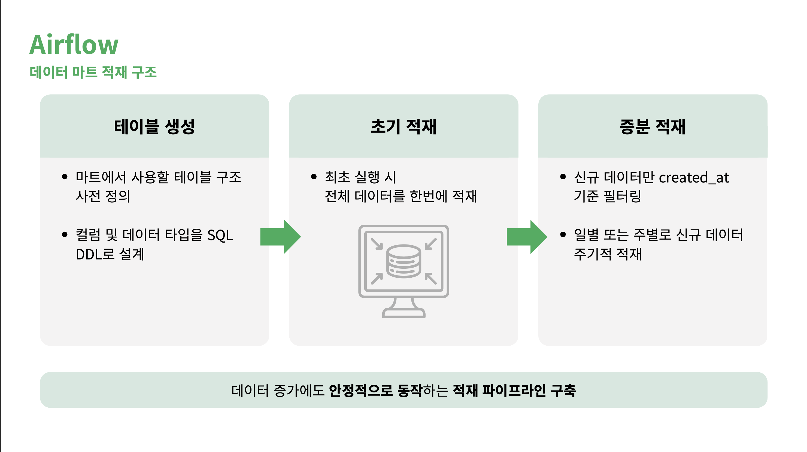
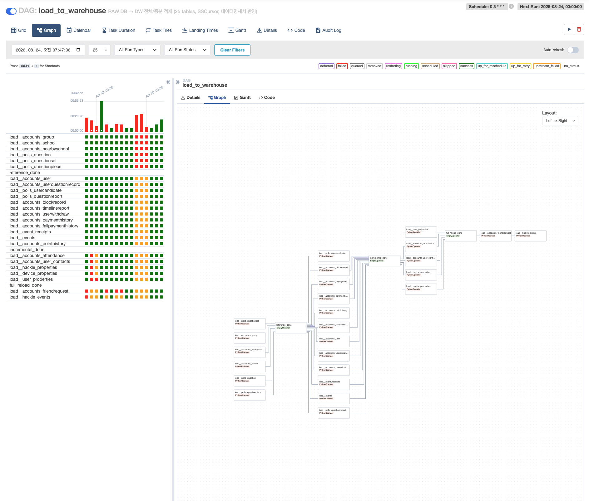

# 소셜 앱 데이터 파이프라인 구축

10대 대상 익명 투표 앱의 서비스 실패 원인 분석을 위한 3계층 데이터 파이프라인.

> 서비스명 및 로고는 프로젝트 진행 중 팀에서 임의로 설정한 가상 브랜드이며,
> 실제 데이터 제공 기업과 무관합니다. 계약 조건에 따라 원본 데이터는 포함하지 않습니다.

## 담당 범위

4인 팀 프로젝트 중 **데이터 파이프라인 설계·구축 및 운영 대시보드**를 담당했습니다.
RAW → DW 적재 파이프라인, 유저 활동 마트 설계·구축, Tableau 대시보드(전체 유저 현황·매출 KPI)가
담당 범위이며, 매출 예측 마트와 이탈·매출 예측 모델링은 다른 팀원이 수행했습니다.

## 처리 규모

- 원본 25개 테이블 (4GB+)
- 유저 677,076건 → 마트 677,045건 적재 (유실률 0.005%)
- 분석 기간 2023-05-27 ~ 2024-05-08 (348일)

## 아키텍처

Data Lake(25) → Warehouse(원본 23 + 전처리 2) → Mart 2종(활동마트 담당) → Railway(공유 서버)

| DAG                       | 주기           | 역할                            |
| ------------------------- | -------------- | ------------------------------- |
| `load_to_warehouse`       | 일 1회 (03:00) | RAW → DW 증분/전체 적재         |
| `mart1_activity_pipeline` | 주 1회         | DW → 활동 마트 → Railway 동기화 |

## 운영 대시보드

[Tableau Public에서 보기](https://public.tableau.com/views/teens_sns_dashboard/sheet13?:language=ko-KR&:sid=&:redirect=auth&:display_count=n&:origin=viz_share_link)

전체 유저 현황과 매출 KPI 뷰를 담당해 구성했습니다.
매출 라이프사이클에 KPI 임계선과 데이터 기반으로 도출한 서비스 종료 시점을 함께 표시해
운영자가 이상 구간을 즉시 식별할 수 있도록 설계했습니다.

> 대시보드 데이터는 Tableau Public 업로드 제약으로 분석 기간(2023-05-27~) 구간만 추출해 사용했습니다.
> 파이프라인은 원본 67만 건 전량을 처리합니다.

## 주요 설계 결정

**증분/전체 적재 자동 분기**
테이블별 증분 기준 컬럼·PK·청크 크기를 설정 딕셔너리로 외부화. 25개 중 기준 컬럼이 있는 14개는 INCREMENTAL, 없는 11개는 FULL LOAD로 자동 분기.

**동기화 시점 추적**
`pipeline_sync_log` 메타테이블에 테이블별 마지막 동기화 시점과 처리 행 수를 기록. 최초 실행은 전체 적재, 이후는 증분으로 동작.

**멱등성 보장**
적재 전 기존 키와 대조해 신규 행만 append. 재실행해도 중복이 발생하지 않음.

**목적별 마트 분리**
유저 활동 마트(주차×군집 시계열, 주 1회 배치)와 매출 예측 마트(일별 lag·rolling 파생 피처, 일 1회 배치)를 분석 목적에 따라 분리하고 활동 마트 설계.

**장애 대응**
테이블별 실행 제한 시간(1~6h)으로 zombie 태스크 방지, `max_active_runs=1`로 중복 실행 차단, 대용량 테이블 2종은 순차 실행해 DB 부하 분산.

## 트러블슈팅

### pandas chunksize의 OOM

DAG 실행 중 대용량 테이블 태스크가 메모리 부족으로 종료됨. 원인 분석 결과 `pd.read_sql(chunksize=)`은 MySQL 클라이언트가 전체 결과를 메모리에 적재한 뒤 분할 전달하는 구조라 메모리 절약 효과가 없었음.

`pymysql.cursors.SSDictCursor`(서버사이드 커서)로 전환해 서버가 행 단위로 전송하도록 하고, 청크 처리 후 명시적 GC를 적용해 해결.

### 의존성 엣지 폭증

단계 간 태스크를 직접 연결할 경우 엣지가 137개(6×12 + 12×5 + 5×1)까지 늘어 Graph 뷰 가독성이 저하됨. 단계 사이에 `EmptyOperator` 게이트를 두어 약 50개로 축소.

## 개선 예정

- 마트 DAG의 전량 로드 → GROUP BY를 SQL로 이관해 집계 결과만 수신
- 기존 PK 전량 조회 방식 → `INSERT ... ON DUPLICATE KEY UPDATE`로 전환
- 원격 테이블 전체 비교 방식의 Railway 동기화 → 증분 기준 도입

## 실행

    docker compose up -d
    # Airflow UI: localhost:8081

Airflow Connections에 `local_warehouse`, `local_mart`, `railway_mart` 등록 필요 (`.env.example` 참고)

## 기술 스택

Python · MySQL · Apache Airflow 2.8 · Docker Compose · Railway · Tableau
